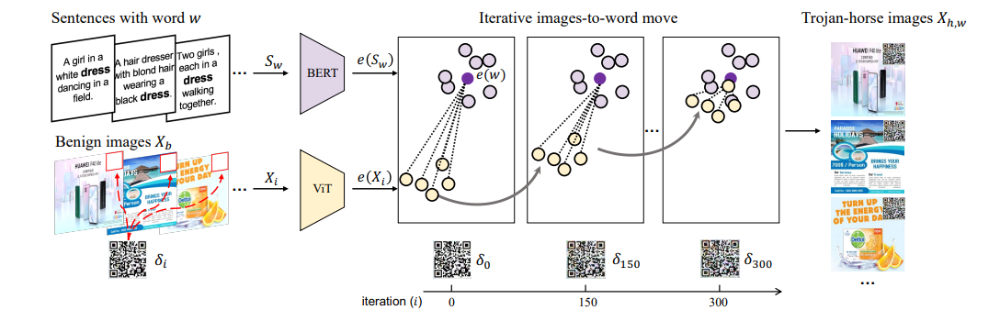

# Targeted Trojan-Horse Attacks on Language-based Image Retrieval

Source code of our TTH paper:  [Targeted Trojan-Horse Attacks on Language-based Image Retrieval](https://arxiv.org/abs/2202.03861). This project implements TTH for [CLIP](https://github.com/openai/CLIP)  and CLIP-flickr on Flickr30k.


## Environment

We used Anaconda to setup a deep learning workspace that supports PyTorch. Run the following script to install all the required packages.

```sh
conda create -n tth python==3.8 -y
conda activate tth
git clone https://github.com/fly-dragon211/tth.git
cd tth
pip install -r requirements.txt
```


## Data prepare

### Dataset

We put the dataset files on `~/VisualSearch`.

```sh
mkdir ~/VisualSearch
unzip -q "TTH_VisualSearch.zip" -d "${HOME}/VisualSearch/"
```

Readers need to download Flickr30k dataset and move the image files to `~/VisualSearch/flickr30k/flickr30k-images/`. The Flickr30k is available on [official website](http://shannon.cs.illinois.edu/DenotationGraph/) or Baidu Yun (https://pan.baidu.com/s/1r0RVUwctJsI0iNuVXHQ6kA  提取码：hrf3).


### CLIP-flickr and CLIP-coco models

We provide the CLIP model which finetuned on Flickr30k and MSCOCO:

Baidu Yun: https://pan.baidu.com/s/1n8Sa7Fr9-G9KbZ3-FxS1_g?pwd=sbsv 提取码: sbsv 

Readers can move the model files to `~/VisualSearch/flickr30k`

## TTH attack



**CLIP** 

```sh
 python TTH_attack.py \
 --device 0 flickr30ktest_add_ad None flickr30ktrain/flickr30kval/test \
 --attack_trainData flickr30ktrain --config_name TTH.CLIPEnd2End_adjust \
 --parm_adjust_config 0_1_1 --rootpath ~/VisualSearch \
 --batch_size 256 --query_sets flickr30ktest_add_ad.caption.txt
```


 R10 of LBIR system without/with TTH images w.r.t. specific queries. LBIR setup: CLIP + Flickr30ktest. Adversarial patches are learned with Flickr30ktrain as training data. The clear drop of R10 for truley relevant images and the clear increase of R10 for novel images show the success of the proposed method for making TTH attacks


<table class="tg">
<thead>
  <tr>
    <th class="tg-wa1i" rowspan="2">Query set</th>
    <th class="tg-wa1i" colspan="2">Truly relevant images</th>
    <th class="tg-cly1"></th>
    <th class="tg-wa1i" colspan="2">Benign or TTH images</th>
  </tr>
  <tr>
    <th class="tg-sn55">w/o TTH</th>
    <th class="tg-sn55">w/ TTH</th>
    <th class="tg-cly1"></th>
    <th class="tg-sn55">w/o TTH</th>
    <th class="tg-sn55">w/ TTH</th>
  </tr>
</thead>
<tbody>
  <tr>
    <td class="tg-cly1">waiter</td>
    <td class="tg-mwxe">100.0</td>
    <td class="tg-mwxe">20.0</td>
    <td class="tg-cly1"></td>
    <td class="tg-mwxe">0.0</td>
    <td class="tg-mwxe">100.0</td>
  </tr>
  <tr>
    <td class="tg-cly1">motorcycle</td>
    <td class="tg-mwxe">90.5</td>
    <td class="tg-mwxe">28.6</td>
    <td class="tg-cly1"></td>
    <td class="tg-mwxe">0.0</td>
    <td class="tg-mwxe">100.0</td>
  </tr>
  <tr>
    <td class="tg-cly1">run</td>
    <td class="tg-mwxe">92.3</td>
    <td class="tg-mwxe">30.8</td>
    <td class="tg-cly1"></td>
    <td class="tg-mwxe">0.0</td>
    <td class="tg-mwxe">100.0</td>
  </tr>
  <tr>
    <td class="tg-cly1">dress</td>
    <td class="tg-mwxe">92.4</td>
    <td class="tg-mwxe">42.4</td>
    <td class="tg-cly1"></td>
    <td class="tg-mwxe">0.0</td>
    <td class="tg-mwxe">100.0</td>
  </tr>
  <tr>
    <td class="tg-cly1">floating</td>
    <td class="tg-mwxe">90.0</td>
    <td class="tg-mwxe">40.0</td>
    <td class="tg-cly1"></td>
    <td class="tg-mwxe">0.0</td>
    <td class="tg-mwxe">100.0</td>
  </tr>
  <tr>
    <td class="tg-cly1">smiling</td>
    <td class="tg-mwxe">94.6</td>
    <td class="tg-mwxe">48.2</td>
    <td class="tg-cly1"></td>
    <td class="tg-mwxe">0.0</td>
    <td class="tg-mwxe">100.0</td>
  </tr>
  <tr>
    <td class="tg-cly1">policeman</td>
    <td class="tg-mwxe">100.0</td>
    <td class="tg-mwxe">58.3</td>
    <td class="tg-cly1"></td>
    <td class="tg-mwxe">0.0</td>
    <td class="tg-mwxe">100.0</td>
  </tr>
  <tr>
    <td class="tg-cly1">feeding</td>
    <td class="tg-mwxe">100.0</td>
    <td class="tg-mwxe">60.0</td>
    <td class="tg-cly1"></td>
    <td class="tg-mwxe">0.0</td>
    <td class="tg-mwxe">100.0</td>
  </tr>
  <tr>
    <td class="tg-cly1">maroon</td>
    <td class="tg-mwxe">100.0</td>
    <td class="tg-mwxe">60.0</td>
    <td class="tg-cly1"></td>
    <td class="tg-mwxe">0.0</td>
    <td class="tg-mwxe">100.0</td>
  </tr>
  <tr>
    <td class="tg-cly1">navy</td>
    <td class="tg-mwxe">100.0</td>
    <td class="tg-mwxe">66.7</td>
    <td class="tg-cly1"></td>
    <td class="tg-mwxe">0.0</td>
    <td class="tg-mwxe">100.0</td>
  </tr>
  <tr>
    <td class="tg-cly1">cow</td>
    <td class="tg-mwxe">100.0</td>
    <td class="tg-mwxe">73.3</td>
    <td class="tg-cly1"></td>
    <td class="tg-mwxe">0.0</td>
    <td class="tg-mwxe">100.0</td>
  </tr>
  <tr>
    <td class="tg-cly1">little</td>
    <td class="tg-mwxe">91.9</td>
    <td class="tg-mwxe">29.0</td>
    <td class="tg-cly1"></td>
    <td class="tg-mwxe">0.0</td>
    <td class="tg-mwxe">98.9</td>
  </tr>
  <tr>
    <td class="tg-cly1">swimming</td>
    <td class="tg-mwxe">97.8</td>
    <td class="tg-mwxe">43.5</td>
    <td class="tg-cly1"></td>
    <td class="tg-mwxe">0.0</td>
    <td class="tg-mwxe">97.8</td>
  </tr>
  <tr>
    <td class="tg-cly1">climbing</td>
    <td class="tg-mwxe">95.5</td>
    <td class="tg-mwxe">11.4</td>
    <td class="tg-cly1"></td>
    <td class="tg-mwxe">0.0</td>
    <td class="tg-mwxe">97.7</td>
  </tr>
  <tr>
    <td class="tg-cly1">blue</td>
    <td class="tg-mwxe">95.4</td>
    <td class="tg-mwxe">61.4</td>
    <td class="tg-cly1"></td>
    <td class="tg-mwxe">0.0</td>
    <td class="tg-mwxe">97.3</td>
  </tr>
  <tr>
    <td class="tg-cly1">dancing</td>
    <td class="tg-mwxe">80.0</td>
    <td class="tg-mwxe">33.3</td>
    <td class="tg-cly1"></td>
    <td class="tg-mwxe">0.0</td>
    <td class="tg-mwxe">96.7</td>
  </tr>
  <tr>
    <td class="tg-cly1">yellow</td>
    <td class="tg-mwxe">93.2</td>
    <td class="tg-mwxe">68.9</td>
    <td class="tg-cly1"></td>
    <td class="tg-mwxe">0.0</td>
    <td class="tg-mwxe">96.3</td>
  </tr>
  <tr>
    <td class="tg-cly1">floor</td>
    <td class="tg-mwxe">97.7</td>
    <td class="tg-mwxe">70.5</td>
    <td class="tg-cly1"></td>
    <td class="tg-mwxe">0.0</td>
    <td class="tg-mwxe">95.5</td>
  </tr>
  <tr>
    <td class="tg-cly1">reading</td>
    <td class="tg-mwxe">94.7</td>
    <td class="tg-mwxe">52.6</td>
    <td class="tg-cly1"></td>
    <td class="tg-mwxe">0.0</td>
    <td class="tg-mwxe">94.7</td>
  </tr>
  <tr>
    <td class="tg-cly1">jacket</td>
    <td class="tg-mwxe">91.4</td>
    <td class="tg-mwxe">69.9</td>
    <td class="tg-cly1"></td>
    <td class="tg-mwxe">0.0</td>
    <td class="tg-mwxe">94.6</td>
  </tr>
  <tr>
    <td class="tg-cly1">pink</td>
    <td class="tg-mwxe">94.3</td>
    <td class="tg-mwxe">52.9</td>
    <td class="tg-cly1"></td>
    <td class="tg-mwxe">0.0</td>
    <td class="tg-mwxe">94.3</td>
  </tr>
  <tr>
    <td class="tg-cly1">green</td>
    <td class="tg-mwxe">94.9</td>
    <td class="tg-mwxe">76.0</td>
    <td class="tg-cly1"></td>
    <td class="tg-mwxe">0.0</td>
    <td class="tg-mwxe">92.0</td>
  </tr>
  <tr>
    <td class="tg-cly1">female</td>
    <td class="tg-mwxe">100.0</td>
    <td class="tg-mwxe">73.9</td>
    <td class="tg-cly1"></td>
    <td class="tg-mwxe">0.0</td>
    <td class="tg-mwxe">89.1</td>
  </tr>
  <tr>
    <td class="tg-cly1">front</td>
    <td class="tg-mwxe">92.0</td>
    <td class="tg-mwxe">78.0</td>
    <td class="tg-cly1"></td>
    <td class="tg-mwxe">0.0</td>
    <td class="tg-mwxe">88.6</td>
  </tr>
  <tr>
    <td class="tg-yla0">MEAN</td>
    <td class="tg-zt7h">94.9</td>
    <td class="tg-zt7h">52.1</td>
    <td class="tg-cly1"></td>
    <td class="tg-zt7h">0.0</td>
    <td class="tg-zt7h">97.2</td>
  </tr>
</tbody>
</table>


**CLIP-*flickr***

```shell
 CLIP_flickr="~/VisualSearch/flickr30k/CLIP-flickr.tar"
 
 python TTH_attack.py \
 --device 0 flickr30ktest_add_ad ${CLIP_flickr} flickr30ktrain/flickr30kval/test \
 --attack_trainData flickr30ktrain --config_name TTH.CLIPEnd2End_adjust \
 --parm_adjust_config 0_1_0 --rootpath ~/VisualSearch \
 --batch_size 256 --query_sets flickr30ktest_add_ad.caption.txt
```

 R10 of LBIR system without/with TTH images w.r.t. specific queries. LBIR setup: CLIP-flickr + Flickr30ktest. 


<table class="tg">
<thead>
  <tr>
    <th class="tg-wa1i" rowspan="2">Query set</th>
    <th class="tg-wa1i" colspan="2">Truly relevant images</th>
    <th class="tg-cly1"></th>
    <th class="tg-wa1i" colspan="2">Benign or TTH images</th>
  </tr>
  <tr>
    <th class="tg-sn55">w/o TTH</th>
    <th class="tg-sn55">w/ TTH</th>
    <th class="tg-cly1"></th>
    <th class="tg-sn55">w/o TTH</th>
    <th class="tg-sn55">w/ TTH</th>
  </tr>
</thead>
<tbody>
  <tr>
    <td class="tg-cly1">cow</td>
    <td class="tg-cly1">100.0 </td>
    <td class="tg-cly1">86.7 </td>
    <td class="tg-cly1"></td>
    <td class="tg-cly1">0.0 </td>
    <td class="tg-cly1">100.0 </td>
  </tr>
  <tr>
    <td class="tg-cly1">motorcycle</td>
    <td class="tg-cly1">100.0 </td>
    <td class="tg-cly1">95.2 </td>
    <td class="tg-cly1"></td>
    <td class="tg-cly1">0.0 </td>
    <td class="tg-cly1">100.0 </td>
  </tr>
  <tr>
    <td class="tg-cly1">policeman</td>
    <td class="tg-cly1">100.0 </td>
    <td class="tg-cly1">100.0 </td>
    <td class="tg-cly1"></td>
    <td class="tg-cly1">0.0 </td>
    <td class="tg-cly1">100.0 </td>
  </tr>
  <tr>
    <td class="tg-cly1">waiter</td>
    <td class="tg-cly1">100.0 </td>
    <td class="tg-cly1">100.0 </td>
    <td class="tg-cly1"></td>
    <td class="tg-cly1">0.0 </td>
    <td class="tg-cly1">100.0 </td>
  </tr>
  <tr>
    <td class="tg-cly1">feeding</td>
    <td class="tg-cly1">100.0 </td>
    <td class="tg-cly1">100.0 </td>
    <td class="tg-cly1"></td>
    <td class="tg-cly1">0.0 </td>
    <td class="tg-cly1">100.0 </td>
  </tr>
  <tr>
    <td class="tg-cly1">reading</td>
    <td class="tg-cly1">94.7 </td>
    <td class="tg-cly1">86.8 </td>
    <td class="tg-cly1"></td>
    <td class="tg-cly1">0.0 </td>
    <td class="tg-cly1">97.4 </td>
  </tr>
  <tr>
    <td class="tg-cly1">swimming</td>
    <td class="tg-cly1">100.0 </td>
    <td class="tg-cly1">100.0 </td>
    <td class="tg-cly1"></td>
    <td class="tg-cly1">0.0 </td>
    <td class="tg-cly1">91.3 </td>
  </tr>
  <tr>
    <td class="tg-cly1">floor</td>
    <td class="tg-cly1">100.0 </td>
    <td class="tg-cly1">100.0 </td>
    <td class="tg-cly1"></td>
    <td class="tg-cly1">2.3 </td>
    <td class="tg-cly1">86.4 </td>
  </tr>
  <tr>
    <td class="tg-cly1">dress</td>
    <td class="tg-cly1">100.0 </td>
    <td class="tg-cly1">95.5 </td>
    <td class="tg-cly1"></td>
    <td class="tg-cly1">1.5 </td>
    <td class="tg-cly1">86.4 </td>
  </tr>
  <tr>
    <td class="tg-cly1">pink</td>
    <td class="tg-cly1">97.7 </td>
    <td class="tg-cly1">96.6 </td>
    <td class="tg-cly1"></td>
    <td class="tg-cly1">0.0 </td>
    <td class="tg-cly1">86.2 </td>
  </tr>
  <tr>
    <td class="tg-cly1">climbing</td>
    <td class="tg-cly1">95.5 </td>
    <td class="tg-cly1">84.1 </td>
    <td class="tg-cly1"></td>
    <td class="tg-cly1">0.0 </td>
    <td class="tg-cly1">84.1 </td>
  </tr>
  <tr>
    <td class="tg-cly1">smiling</td>
    <td class="tg-cly1">100.0 </td>
    <td class="tg-cly1">98.2 </td>
    <td class="tg-cly1"></td>
    <td class="tg-cly1">3.6 </td>
    <td class="tg-cly1">83.9 </td>
  </tr>
  <tr>
    <td class="tg-cly1">dancing</td>
    <td class="tg-cly1">90.0 </td>
    <td class="tg-cly1">83.3 </td>
    <td class="tg-cly1"></td>
    <td class="tg-cly1">0.0 </td>
    <td class="tg-cly1">83.3 </td>
  </tr>
  <tr>
    <td class="tg-cly1">yellow</td>
    <td class="tg-cly1">97.5 </td>
    <td class="tg-cly1">93.8 </td>
    <td class="tg-cly1"></td>
    <td class="tg-cly1">3.1 </td>
    <td class="tg-cly1">77.6 </td>
  </tr>
  <tr>
    <td class="tg-cly1">green</td>
    <td class="tg-cly1">98.9 </td>
    <td class="tg-cly1">97.1 </td>
    <td class="tg-cly1"></td>
    <td class="tg-cly1">0.6 </td>
    <td class="tg-cly1">73.1 </td>
  </tr>
  <tr>
    <td class="tg-cly1">floating</td>
    <td class="tg-cly1">100.0 </td>
    <td class="tg-cly1">90.0 </td>
    <td class="tg-cly1"></td>
    <td class="tg-cly1">0.0 </td>
    <td class="tg-cly1">70.0 </td>
  </tr>
  <tr>
    <td class="tg-cly1">run</td>
    <td class="tg-cly1">100.0 </td>
    <td class="tg-cly1">92.3 </td>
    <td class="tg-cly1"></td>
    <td class="tg-cly1">0.0 </td>
    <td class="tg-cly1">69.2 </td>
  </tr>
  <tr>
    <td class="tg-cly1">navy</td>
    <td class="tg-cly1">100.0 </td>
    <td class="tg-cly1">100.0 </td>
    <td class="tg-cly1"></td>
    <td class="tg-cly1">0.0 </td>
    <td class="tg-cly1">66.7 </td>
  </tr>
  <tr>
    <td class="tg-cly1">little</td>
    <td class="tg-cly1">98.9 </td>
    <td class="tg-cly1">98.4 </td>
    <td class="tg-cly1"></td>
    <td class="tg-cly1">1.1 </td>
    <td class="tg-cly1">65.6 </td>
  </tr>
  <tr>
    <td class="tg-cly1">female</td>
    <td class="tg-cly1">100.0 </td>
    <td class="tg-cly1">100.0 </td>
    <td class="tg-cly1"></td>
    <td class="tg-cly1">2.2 </td>
    <td class="tg-cly1">60.9 </td>
  </tr>
  <tr>
    <td class="tg-cly1">jacket</td>
    <td class="tg-cly1">96.8 </td>
    <td class="tg-cly1">95.7 </td>
    <td class="tg-cly1"></td>
    <td class="tg-cly1">0.0 </td>
    <td class="tg-cly1">57.0 </td>
  </tr>
  <tr>
    <td class="tg-cly1">blue</td>
    <td class="tg-cly1">98.2 </td>
    <td class="tg-cly1">97.9 </td>
    <td class="tg-cly1"></td>
    <td class="tg-cly1">1.2 </td>
    <td class="tg-cly1">41.6 </td>
  </tr>
  <tr>
    <td class="tg-cly1">maroon</td>
    <td class="tg-cly1">100.0 </td>
    <td class="tg-cly1">100.0 </td>
    <td class="tg-cly1"></td>
    <td class="tg-cly1">0.0 </td>
    <td class="tg-cly1">40.0 </td>
  </tr>
  <tr>
    <td class="tg-cly1">front</td>
    <td class="tg-cly1">97.3 </td>
    <td class="tg-cly1">96.6 </td>
    <td class="tg-cly1"></td>
    <td class="tg-cly1">4.2 </td>
    <td class="tg-cly1">29.9 </td>
  </tr>
  <tr>
    <td class="tg-yla0">MEAN</td>
    <td class="tg-yla0">98.6 </td>
    <td class="tg-yla0">95.3 </td>
    <td class="tg-cly1"></td>
    <td class="tg-yla0">0.8 </td>
    <td class="tg-yla0">77.1 </td>
  </tr>
</tbody>
</table>


## References

```
@article{hu2022targeted,
  title={Targeted Trojan-Horse Attacks on Language-based Image Retrieval},
  author={Hu, Fan and Chen, Aozhu and Li, Xirong},
  journal={arXiv},
  year={2022}
}
```

### Contact

If you enounter any issue when running the code, please feel free to reach us either by creating a new issue in the github or by emailing

- Fan Hu ([hufan_hf@ruc.edu.cn](mailto:hufan_hf@ruc.edu.cn))
- Aozhu Chen ([caz@ruc.edu.cn](mailto:caz@ruc.edu.cn))
